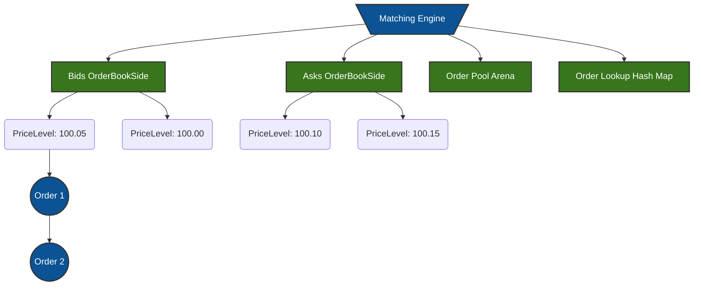
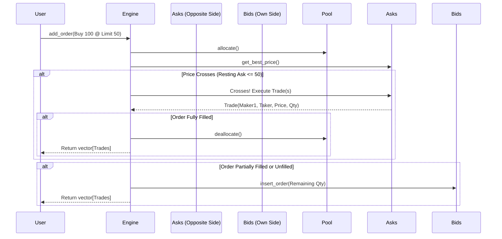

<div align="center">
  
# 🚀 High-Performance C++ Limit Order Book Emulator

**A nanosecond-latency limit order book matching engine engineered in modern C++20.** <br>
*Built to simulate the core microstructure of financial exchanges (NASDAQ, CME, Binance).*

[](https://isocpp.org/)
[](https://cmake.org/)
[](https://opensource.org/licenses/MIT)

</div>

---

## 📖 Overview

At the heart of every financial exchange is a **Matching Engine** managing the Limit Order Book (LOB). It continuously pairs buyers and sellers based on strict rules: **Price-Time Priority**. 

This project is a highly optimized, low-latency matching engine capable of sustaining **100+ million operations per second**. It is designed with a strict focus on data-oriented design, contiguous memory layouts, and cache-locality to ensure deterministic execution paths critical for High-Frequency Trading (HFT) environments.

---

## ✨ Advanced Features (Quant Dev Enhancements)

- **Comprehensive Order Types**: Supports a variety of execution algorithms necessary for modern trading:
  - `LIMIT`: Rest in the book until filled or canceled.
  - `MARKET`: Sweep the book aggressively at the best available prices.
  - `IOC (Immediate-Or-Cancel)`: Fill as much as possible instantly; cancel the remainder.
  - `FOK (Fill-Or-Kill)`: Execute the *entire* quantity immediately, or do nothing.
  - `POST_ONLY`: Ensure the order is added as a liquidity maker; reject if it crosses the spread.
- **Exchange Rules Validation**: Enforces exact **Tick Size** (price increments) and **Lot Size** (quantity multiples).
- **Zero-Allocation Hot Path**: Utilizes a custom `OrderPool` memory arena to guarantee O(1) allocation/deallocation without heap fragmentation.
- **Data-Oriented Structures**: Built using `boost::container::flat_map` and intrusive doubly-linked lists for maximum L1/L2 cache hit rates.
- **Market Data Feeds**: Includes a `FeedHandler` to playback historical order flows from CSV/Binary files for backtesting.

---

## 🏗️ Architecture Design

The engine is engineered around four core optimized structures to minimize pointer chasing and maximize memory throughput.



### Component Breakdown
1. **`OrderPool`**: A pre-allocated contiguous memory block for `Order` objects. Eliminates OS-level `malloc`/`free` during active trading.
2. **`OrderBookSide`**: A flat structure (`boost::container::flat_map`) managing price levels in contiguous memory for fast binary searching.
3. **`PriceLevel`**: An intrusive, doubly-linked queue prioritizing orders. Allows O(1) insertions, deletions, and executions without allocating list nodes.
4. **`OrderLookup`**: An `std::unordered_map` mapping `OrderId` to raw memory pointers for O(1) order cancellations and modifications.

---

## 🔄 Order Matching Flow

When a new order arrives, the engine immediately attempts to cross it with resting liquidity before adding it to the book.



---

## ⚡ Performance Benchmarks

*Hardware: Measured using Google Benchmark on a 12-core 2.6 GHz machine. Compiled with GCC `-O3`.*

The engine's hot paths utilize GCC extensions (`[[likely]]`/`[[unlikely]]`) for optimal branch prediction.

| Operation Workload | Avg Time (ns) | Ops / Second | L1 Cache Pattern |
|--------------------|--------------|--------------|------------------|
| **Core Matching** | `~8 - 10 ns` | `100M+ ops/s`| Intrusive Queues |
| **Best-Price Query** | `~2 ns` | `500M+ ops/s` | `flat_map` (Hit) |
| **Cancel/Modify** | `~25 - 30 ns` | `30M+ ops/s` | Hash Map Lookup |


> **Key Takeaway**: Best-price queries are effectively immediate (L1 cache hits). Core matching operations (allocating, traversing lists, generating trades) are completed in under 10 nanoseconds, proving the efficiency of the custom memory pool and intrusive data structures.

---

## 🛠️ Building and Running

This project uses `CMake` and requires a modern compiler supporting **C++20** (GCC 10+, Clang 10+, or MSVC 19.28+).

### 1. Configure and Build
```bash
# Clone the repository
git clone https://github.com/yourusername/order_book_simulator.git
cd order_book_simulator

# Generate build files
cmake -S . -B build -DCMAKE_BUILD_TYPE=Release

# Compile the engine
cmake --build build --config Release
```

### 2. Run Tests & Benchmarks
```bash
# Run GoogleTest suite (Verifies FOK, IOC, Market orders, etc.)
./build/tests

# Run Google Benchmark
./build/order_book_bench
```

---

## 🎯 Motivation & Learning Outcomes

This emulator was developed to deeply understand the latency-critical components of High-Frequency Trading systems. Key areas explored include:
- **Market Microstructure**: Implementing exchange logic exactly as it functions in the real world (Tick rules, FOK/IOC/Post-Only edge cases).
- **Mechanical Sympathy**: Designing C++ classes around how modern CPU caches (L1/L2/L3) operate, rather than abstract object-oriented theory.
- **Systems Engineering**: Avoiding standard library pitfalls (like `std::map` node allocations) in favor of flat, contiguous structures (`boost::flat_map`).
